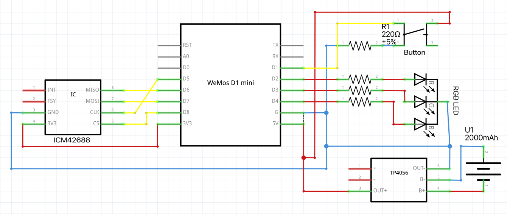

- [Smart Office Prototype Documentation](#smart-office-prototype-documentation)
  - [Config](#config)
    - [Wifi](#wifi)
    - [IMU](#imu)
    - [MQTT](#mqtt)
    - [EEPROM](#eeprom)
    - [Variance](#variance)
  - [LED](#led)
  - [Setup](#setup)
    - [RGB LED](#rgb-led)
    - [IMU](#imu-1)
    - [Button](#button)
    - [Battery](#battery)

# Smart Office Prototype Documentation

The Smart Office System optimizes workspace energy efficiency through intelligent desk occupancy detection. By integrating MQTT-enabled power plugs, the system automatically controls power delivery to individual desks, ensuring power is used only when needed. Even when in standby mode, monitors, docking stations, and other peripherals consume energy, but this system eliminates that waste by completely turning off power when desks are unoccupied.

The system used an ESP8266 on A Wemos D1 Mini Dev board as a central controller. An ICM-42688 accelerometer is used to measure acceleration along the Z-axis caused by subtle movements such as typing on a keyboard. Furthermore, a opt-out button and an RGB LED are present for user interaction.

## Config

The system relies on multiple configuration values all of which can be found in the `config.h` file.

### Wifi

| Variable Name           | Explanation                                                                                                                           | Expected Value                              | Note                                                                                |
| ----------------------- | ------------------------------------------------------------------------------------------------------------------------------------- | ------------------------------------------- | ----------------------------------------------------------------------------------- |
| WIFI_SSID               | The network name of the wifi network to be used                                                                                       | A string enclosed by double quotation marks | Network has to provide access to an MQTT broker either locally or over the internet |
| WIFI_PSK                | The password for the above network                                                                                                    | A string enclosed by double quotation marks |                                                                                     |
| WIFI_TIMEOUT_IN_SECONDS | The time in seconds the system will attempt to establish a connection. After the time has run out, the system will go into error mode | A natural number                            |                                                                                     |

### IMU

| Variable Name                                              | Explanation                                                                                                                                                        | Expected Value                                      | Note                                                                               |
| ---------------------------------------------------------- | ------------------------------------------------------------------------------------------------------------------------------------------------------------------ | --------------------------------------------------- | ---------------------------------------------------------------------------------- |
| IMU_CONNECTION_ATTEMPTS                                    | The connection to the IMU has to be established over SPI. This number defined how many times the sensor attempts a connection before entering error mode           | A natural number                                    |                                                                                    |
| IMU_CALIBRATION_TIME_IN_SECONDS                            | The IMU measures the minimum and maximum acceleration to generate a dynamic range. This number defines over what time period the measurements are taken in seconds | A natural number                                    |                                                                                    |
| MOTION_THRESHOLD_DEFAULT_VALUE                             | The value measured in G (gravitational constant) by which the sensor readings have to differ in either direction from the minimum or maximum value described above | A decimal number greater than `0` and less than `1` | This is a default value. The setting can later be overwritten by the user via MQTT |
| OPT_OUT_BUTTON_TIMEOUT_IN_MINUTES_DEFAULT_VALUE            | This setting defines how long in minutes the system should disable measurements and keep power on upon enabling the opt-out feature                                | A natural number not exceeding 65536                | This is a default value. The setting can later be overwritten by the user via MQTT |
| INACTIVITY_TIMEOUT_IN_MINUTES_DEFAULT_VALUE                | After which time of absence in minutes the system should disable power to the workstation                                                                          | A natural number not exceeding 255                  | This is a default value. The setting can later be overwritten by the user via MQTT |
| SAMPLE_SPEED_IN_MILLISECONDS_DEFAULT_VALUE                 | The interval in milliseconds with which the sensor queries presence                                                                                                | A natural number not exceeding 255                  | This is a default value. The setting can later be overwritten by the user via MQTT |
| MINIMUM_MOTION_DETECTION_COUNT_REQUIRED_DEFAULT_VALUE      | The minimum number of positive motion readings required within the specified timeframe to confirm occupancy and trigger system actions                             | A natural number not exceeding 255                  | This is a default value. The setting can later be overwritten by the user via MQTT |
| MINIMUM_MOTION_DETECTION_TIMEFRAME_IN_CYCLES_DEFAULT_VALUE | The number of sensor readings (cycles) within which the required number of positive motion readings must occur to confirm occupancy                                | A natural number not exceeding 255                  | This is a default value. The setting can later be overwritten by the user via MQTT |

### MQTT

| Variable Name                            | Explanation                                                                                                                           | Expected Value                              | Note                                                                                                                                                           |
| ---------------------------------------- | ------------------------------------------------------------------------------------------------------------------------------------- | ------------------------------------------- | -------------------------------------------------------------------------------------------------------------------------------------------------------------- |
| MQTT_HOST                                | The IP or URL of the MQTT-broker for the system                                                                                       | A string enclosed by double quotation marks |                                                                                                                                                                |
| MQTT_PORT                                | The port of the MQTT-broker for the system                                                                                            | A natural number                            |                                                                                                                                                                |
| MQTT_USERNAME                            | The username for the MQTT-broker with sufficient permission to publish and subscribe                                                  | A string enclosed by double quotation marks |
| MQTT_PASSWORD                            | The password for the user on the MQTT-broker                                                                                          | A string enclosed by double quotation marks |                                                                                                                                                                |
| MQTT_SWITCH_CMND_TOPIC_PREFIX            | The common topic prefix on the MQTT broker to which all MQTT switches subscribe for receiving commands (e.g., "cmnd/")                | A string enclosed by double quotation marks |                                                                                                                                                                |
| MQTT_SWITCH_TOPIC_SUFFIX                 | The suffix representing the unique identifier of the specific MQTT switch controlling the workstation's power                         | A string enclosed by double quotation marks |                                                                                                                                                                |
| MQTT_ESP_STATUS_TOPIC                    | The topic on the MQTT broker that the controller will publish its presence status to                                                  | A string enclosed by double quotation marks |                                                                                                                                                                |
| MQTT_ESP_TELE_TOPIC                      | The topic on the MQTT broker that the controller will publish its telemetry data to                                                   | A string enclosed by double quotation marks |                                                                                                                                                                |
| MQTT_ESP_CMND_TOPIC                      | The topic on the MQTT broker that the controller will publish the user editable values to                                             | A string enclosed by double quotation marks | The controller will subscribe to the topic amended by a `/set`                                                                                                 |
| MQTT_ESP_CMND_TOPIC                      | A unique ID for each controller to distinguish the MQTT messages                                                                      | A string enclosed by double quotation marks | This value is added to the end of `MQTT_ESP_STATUS_TOPIC`, `MQTT_ESP_TELE_TOPIC` and `MQTT_ESP_CMND_TOPIC`. E.g. `MQTT_ESP_CMND_TOPIC` + `MQTT_ESP_CMND_TOPIC` |
| MQTT_CONNECTION_TIMEOUT_IN_SECONDS       | The time in seconds the system will attempt to establish a connection. After the time has run out, the system will go into error mode | A natural number                            |                                                                                                                                                                |
| MQTT_PUBLISH_ATTEMPTS                    | How many times the controller should attempt to resend the desired power state of the switch to MQTT in case it fails the first time  | A natural number                            |
| MQTT_PUBLISH_RETRY_DELAY_IN_MILLISECONDS | The delay in milliseconds with which messages are sent out again in case of failure as described above                                | A natural number                            |                                                                                                                                                                |

### EEPROM

| Variable Name | Explanation                                             | Expected Value                         | Note                                                                 |
| ------------- | ------------------------------------------------------- | -------------------------------------- | -------------------------------------------------------------------- |
| EEPROM_SIZE   | The size in bytes the EEPROM should be initialised with | A natural number lower than 4096 (4kB) | EEPROM size is limited. The smallest possible number should be used. |

### Variance

The version in [wip/Variance](https://github.com/TheRealTimo/SmartOffice/tree/wip/varianceDetection) supports automatic recalibration through variance calculation

| :warning: WARNING                                                                                                                                                                                                                                                   |
| :------------------------------------------------------------------------------------------------------------------------------------------------------------------------------------------------------------------------------------------------------------------ |
| Variance calculation slows down the system due to the calculations needed. As a result, some vibrations will not be detected as the controller is busy with calculations rather than sensor measurements. It is currently a proof-of-concept rather than a feature. |

| Variable Name                            | Explanation                                                                                                                         | Expected Value                                      | Note                                                                        |
| ---------------------------------------- | ----------------------------------------------------------------------------------------------------------------------------------- | --------------------------------------------------- | --------------------------------------------------------------------------- |
| IS_VARIANCE_CALCULATION_ENABLED          | A boolean representation to enable or disable variance calculation altogether                                                       | `0` to disable calculations and `1` to enable them  |                                                                             |
| VARIANCE_CALCULATION_SAMPLE_SIZE         | The number of previous readings to be considered in the variance calculation                                                        | A natural number                                    | The higher the number, the more longer the delay caused by the calculations |
| VARIANCE_RECALIBARTION_THRESHOLD         | The number relative to the initial measurements by which the variance has to differ to trigger a recalibration of the dynamic range | A decimal number greater than `0` and less than `1` |                                                                             |
| VARIANCE_CALCULATION_INTERVAL_IN_SECONDS | The interval in seconds at which variance calculations are performed                                                                | A natural number                                    |                                                                             |

## LED

The RGB LED indicates different internal status of the controller.
|Color|Meaning|Action|
|------|------|------|
|Static red|The controller encountered an error that it is trying to recover from||
|Blinking red|The controller encountered an error that it cannot recover from|Check IMU and Wifi. Restart device|
|White|The controller is initialising and setting up WIFI, MQTT and the IMU|Stand back|
|Yellow|The controller is initialising the dynamic acceleration range|Stand back and do not cause vibrations or movement of of the sensor. Otherwise restart device to restart measurements|
|Green|The controller is operational and has detected presence through vibrations and published the status to MQTT||
|Blue|The system is operational but has not detected presence through vibrations. The absence status has been published to MQTT|Use the workstation or tap on the desk to enable power|
|Cyan|The system is currently paused via opt-out. No measurements will be taken and power remains on|Press the button attached to the controller or disable opt-out again via MQTT. Otherwise, the system will be opted-out until `OPT_OUT_BUTTON_TIMEOUT_IN_MINUTES_DEFAULT_VALUE` or the user defined value runs out|

## Setup

### RGB LED

The RGB LED uses a common cathode. Each color requires a different voltage and thus different resistors for each color are used. Red requires the lowest power and thus uses a 100Ω resistor. Green and blue both use a 47Ω resistor. This assumes 5V from the digital output of the Wemos D1. These values might vary with different LEDs or boards. If an RGB LED uses a common anode, the values of HIGH and LOW in the code have to be swapped. The buttons are connected to D2 through D4 and use digital pins 4, 0 and 2 for red, green and blue respectively.

### IMU

The ICM42688 is connected via SPI and thus uses pins D5 through D8 as as those are the SPI pins on the ESP8266 Wemos D1 Dev board. This might vary with different boards or models. ChipSelect/SlaveSelect for SPI is on D8(digital pin 15)

### Button

The opt-out button is connected D1 (digital pin 5). D0 (digital pin 13) is unavailable for interrupt calls. The button uses a pull down resistor.

### Battery

The TP4056 allows for the controller to use USB or the 2000mAh battery. When possible, power is taken from USB to charge the battery and power the controller. Once USB is unavailable (power shut off by the smart switch) the battery is used. The TP4056 is connected directly to the Wemos D1 Mini board via 5V and GND.
